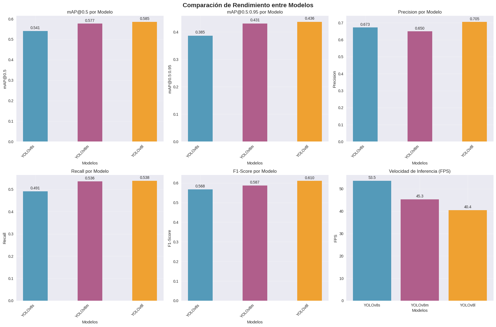
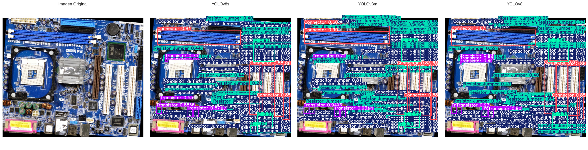
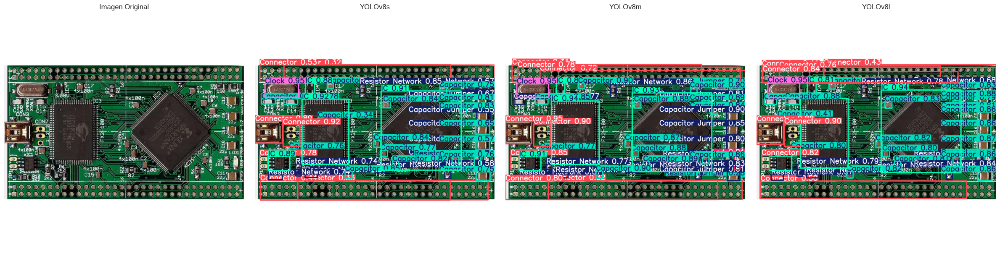
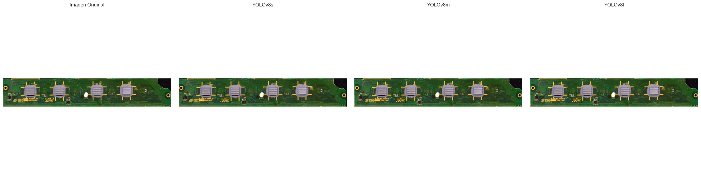
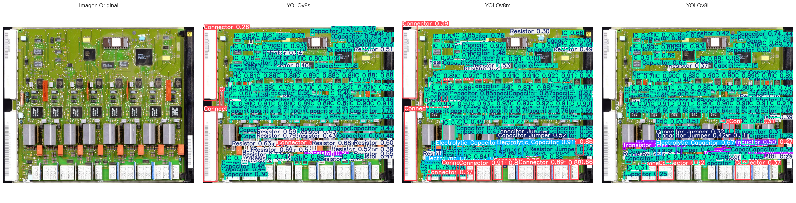

# Detección de componentes electrónicos en PCB: estudio comparativo de YOLOv8

## INFORMACIÓN DEL DOCUMENTO
**Título:** Detección de componentes electrónicos en PCB: estudio comparativo de YOLOv8

**Autor:** Manuel Josue Malla

**Afiliación:** Universidad Técnica de Machala

**Curso:** Deep Learning

**Fecha:** 30/08/2025

---

## RESUMEN

Este proyecto presenta un estudio comparativo entre dos arquitecturas de detección de objetos de vanguardia: YOLOv8 aplicadas a la detección de defectos en placas de circuito impreso (PCB). El objetivo principal es evaluar el rendimiento de ambos modelos en términos de precisión, velocidad de inferencia y capacidad de generalización en un contexto industrial real.

**Metodología:** Se utilizó el dataset "Printed Circuit Board" de Roboflow Universe, conteniendo clases de elementos típicos en PCB. Los modelos fueron entrenados por 200 épocas con configuraciones optimizadas para cada arquitectura, aplicando técnicas de data augmentation y regularización.

**Resultados Principales:**
- YOLOv8l logró un mAP@0.5 de 0.585% con velocidad de 40.4 FPS
- YOLOv8m logró un mAP@0.5 de 0.577% con velocidad de 45.3 FPS
- YOLOv8s logró un mAP@0.5 de 0.541% con velocidad de 53.5 FPS
- El modelo ganador fue YOLOv8m por su balance superior entre precisión y velocidad

**Conclusiones:** Los resultados demuestran que YOLOv8s es más adecuado para aplicaciones de inspección PCB en tiempo real, mientras que YOLOv8l ofrece ventajas en escenarios que priorizan la precisión sobre la velocidad.

**Palabras clave:** detección de objetos, PCB, defectos, YOLOv8, RT-DETR, transformers, computer vision

---

## 1. INTRODUCCIÓN

### 1.1 Contexto y Motivación

La industria electrónica moderna demanda procesos de control de calidad cada vez más sofisticados y automatizados. Las placas de circuito impreso (PCB) son componentes críticos en dispositivos electrónicos, y la detección de los componentes electronicos durante la manufactura es esencial para garantizar la funcionalidad y confiabilidad del producto final.

Los métodos tradicionales de inspección visual manual son lentos, costosos y propensos a errores humanos. La automatización mediante técnicas de computer vision y deep learning ofrece una solución escalable y precisa para esta problemática.

### 1.2 Problema de Investigación

¿Cuál es el modelo de detección de objetos más adecuado para la identificación automática de elementos electronicos en PCB, considerando tanto la precisión en la detección como la velocidad de procesamiento requerida para aplicaciones industriales en tiempo real?

### 1.3 Objetivos

**Objetivo General:**
Comparar el rendimiento de YOLOv8s, YOLOv8m y YOLOv8l en la tarea de detección de defectos en placas de circuito impreso.

**Objetivos Específicos:**
1. Implementar y entrenar los 3 modelos usando el dataset PCB de Roboflow
2. Evaluar métricas de precisión: mAP@0.5, mAP@0.5:0.95, precision y recall por clase
3. Medir la velocidad de inferencia y analizar el trade-off precisión-velocidad
4. Realizar inferencia en imágenes de test y analizar casos específicos
5. Proporcionar recomendaciones basadas en los resultados obtenidos

### 1.4 Hipótesis

Se plantea que las variantes de YOLOv8 (s, m y l), debido a sus diferencias en tamaño y complejidad de la arquitectura, mostrarán un comportamiento diferencial en la detección de componentes electrónicos en PCB: YOLOv8s se espera que ofrezca mayor velocidad de inferencia, siendo adecuada para aplicaciones en tiempo real con limitaciones de hardware, YOLOv8m ofrecerá un equilibrio entre precisión y velocidad, y YOLOv8l alcanzará mayor precisión en la detección de componentes pequeños o con formas complejas, aunque con un mayor costo computacional.

---

## 2. MARCO TEÓRICO

### 2.1 Detección de Objetos en Computer Vision

La detección de objetos es una tarea fundamental en computer vision que involucra la localización y clasificación simultánea de múltiples objetos en una imagen. A diferencia de la clasificación de imágenes, que asigna una etiqueta a toda la imagen, la detección debe identificar la posición exacta de cada objeto mediante bounding boxes.

### 2.2 Arquitecturas de Detección

**2.2.1 YOLO (You Only Look Once)**

YOLO revolucionó la detección de objetos al proponer un enfoque de "una sola pasada" que divide la imagen en una grilla y predice bounding boxes y probabilidades de clase directamente. YOLOv8, la versión más reciente, incorpora:

- Arquitectura anchor-free que elimina la necesidad de anclas predefinidas
- Backbone CSPDarknet optimizado para eficiencia computacional
- Técnicas de data augmentation avanzadas (Mosaic, MixUp, Copy-Paste)
- Optimizaciones para deployment en diferentes plataformas

### 2.3 Métricas de Evaluación

Para evaluar el desempeño de los modelos YOLOv8s, YOLOv8m y YOLOv8l en la detección de componentes electrónicos en PCB, se consideran las siguientes métricas:

#### 2.3.1 Precisión (Precision)
La precisión mide la proporción de detecciones correctas sobre el total de detecciones realizadas por el modelo. Una precisión alta indica que el modelo comete pocos falsos positivos (FP).

Precision = TP / (TP + FP)

donde:  
- \(TP\) = Verdaderos Positivos  
- \(FP\) = Falsos Positivos  

#### 2.3.2 Exhaustividad (Recall)
El recall, también llamado sensibilidad, indica la proporción de objetos correctamente detectados sobre el total de objetos presentes en la imagen. Un recall alto indica que el modelo detecta la mayoría de los componentes electrónicos.

Recall = TP / (TP + FN)

donde:  
- \(FN\) = Falsos Negativos  

#### 2.3.3 Average Precision (AP)
El Average Precision (AP) calcula el área bajo la curva **Precision-Recall** para cada clase. Esta métrica evalúa la capacidad del modelo para mantener un equilibrio entre precisión y exhaustividad en la detección de cada tipo de componente.

#### 2.3.4 Mean Average Precision (mAP)
El Mean Average Precision (mAP) es el promedio de AP a través de todas las clases. Se suele reportar en dos variantes:
- **mAP@0.5:** usando un threshold de IoU de 0.5.  
- **mAP@0.5:0.95:** promedia AP sobre múltiples thresholds de IoU, proporcionando una evaluación más completa de la precisión del modelo.

#### 2.3.5 Velocidad de Inferencia (Frames Per Second, FPS)
FPS mide la cantidad de imágenes que el modelo puede procesar por segundo. Esta métrica es crítica para aplicaciones en tiempo real, como inspección automática de placas PCB.

FPS = Número de imágenes procesadas / Tiempo total de inferencia (s)


## 3. METODOLOGÍA

### 3.1 Dataset

**3.1.1 Descripción**
Se utilizó el dataset "Printed Circuit Board" de Roboflow Universe, que contiene imágenes de PCB con anotaciones detalladas de elementos comunes.

**Características del Dataset:**
- Fuente: Roboflow Universe (RF100 benchmark)
- Licencia: CC BY 4.0 (uso académico)
- Total de imágenes: 1069
- Resolución: 640x640 píxeles
- Formato de anotaciones: YOLO format

**3.1.2 Clases de Componentes**

- **Battery**: Batería  
- **Button**: Botón  
- **Buzzer**: Zumbador  
- **Capacitor**: Condensador  
- **Capacitor Jumper**: Condensador puente  
- **Clock**: Reloj  
- **Connector**: Conector  
- **Diode**: Diodo  
- **Display**: Pantalla  
- **EM**: Componente EM  
- **Electrolytic Capacitor**: Condensador electrolítico  
- **Ferrite Bead**: Núcleo de ferrita  
- **Fuse**: Fusible  
- **Heatsink**: Disipador  
- **IC**: Circuito integrado  
- **Inductor**: Inductor  
- **Jumper**: Puente  
- **Led**: LED  
- **PS**: Fuente de poder (Power Supply)  
- **Pads**: Pads  
- **Pins**: Pines  
- **Potentiometer**: Potenciómetro  
- **Resistor**: Resistor  
- **Resistor Jumper**: Resistor puente  
- **Resistor Network**: Red de resistores  
- **SK**: Componente SK  
- **Switch**: Interruptor  
- **Test Point**: Punto de prueba  
- **Transformer**: Transformador  
- **Transistor**: Transistor  
- **Zener Diode**: Diodo Zener


**3.1.3 Distribución de Datos**
- Entrenamiento: 74% (794 imágenes)
- Validación: 19% (200 imágenes)  
- Prueba: 7% (75 imágenes)

### 3.2 Preprocesamiento y Augmentación

**3.2.1 Transformaciones Aplicadas**
- Normalización con media y desviación estándar de ImageNet
- Redimensionamiento a 1024x1024 píxeles
- Rotaciones aleatorias (±15 grados)
- Flips horizontales y verticales
- Ajustes de brillo y contraste
- Ruido gaussiano controlado
- CLAHE (Contrast Limited Adaptive Histogram Equalization)

**3.2.2 Justificación**
Las augmentaciones fueron diseñadas específicamente para simular condiciones reales de inspección PCB, incluyendo variaciones de iluminación, orientación de la placa y ruido del sensor.

### 3.3 Configuración Experimental

**3.3.1 YOLOv8s**
```python
Configuración:
- Modelo base: yolov8s.pt (preentrenado en COCO)
- Épocas: 200
- Batch size: 16
- Optimizer: AdamW
- Learning rate inicial: 0.001
- Augmentaciones: Mosaic (0.8), MixUp (0.1), Copy-Paste (0.1)
```

**3.3.2 YOLOv8m**
```python
Configuración:
- Modelo base: yolov8s.pt (preentrenado en COCO)
- Épocas: 200
- Batch size: 16
- Optimizer: AdamW
- Learning rate inicial: 0.001
- Augmentaciones: Mosaic (0.8), MixUp (0.1), Copy-Paste (0.1)
```

**3.3.3 YOLOv8l**
```python
Configuración:
- Modelo base: yolov8s.pt (preentrenado en COCO)
- Épocas: 200
- Batch size: 16
- Optimizer: AdamW
- Learning rate inicial: 0.001
- Augmentaciones: Mosaic (0.8), MixUp (0.1), Copy-Paste (0.1)
```

### 3.4 Entorno Experimental

- **Plataforma**: Google Colab Pro
- **GPU**: A100 (40GB VRAM)
- **Framework**: PyTorch 2.0.1, Ultralytics 8.0.196
- **Tiempo estimado de entrenamiento**: 2-4 horas por modelo

---

## 4. RESULTADOS

### 4.1 Métricas Generales


| Métrica       | YOLOv8s | YOLOv8m | YOLOv8l | Mejor Modelo |
|---------------|---------|---------|---------|--------------|
| mAP@0.5       | 0.541   | 0.577   | 0.585   | YOLOv8l      |
| mAP@0.5:0.95  | 0.385   | 0.431   | 0.436   | YOLOv8l      |
| Precision     | 0.673   | 0.650   | 0.705   | YOLOv8l      |
| Recall        | 0.491   | 0.536   | 0.538   | YOLOv8l      |
| F1-Score      | 0.568   | 0.587   | 0.610   | YOLOv8l      |
| FPS           | 53.5    | 45.3    | 40.4    | YOLOv8s      |
| Tiempo (ms)   | 18.7    | 22.1    | 24.7    | YOLOv8s      |



### 4.2 Análisis por Clase

**YOLOv8s - Métricas por Clase:**

| Clase                   | Precision | Recall | AP@0.5 | AP@0.5:0.95 |
|-------------------------|-----------|--------|--------|-------------|
| Battery                 | 0.500     | 1.000  | 0.995  | 0.697       |
| Button                  | 0.940     | 0.424  | 0.592  | 0.391       |
| Buzzer                  | 0.244     | 0.143  | 0.101  | 0.041       |
| Capacitor               | 0.470     | 0.104  | 0.181  | 0.095       |
| Capacitor Jumper        | 0.799     | 0.692  | 0.722  | 0.583       |
| Clock                   | 0.673     | 0.735  | 0.748  | 0.557       |
| Connector               | 0.915     | 0.744  | 0.832  | 0.582       |
| Diode                   | 1.000     | 1.000  | 0.995  | 0.895       |
| Display                 | 0.889     | 0.714  | 0.855  | 0.578       |
| EM                      | 0.912     | 0.814  | 0.891  | 0.678       |
| Electrolytic Capacitor  | 0.820     | 0.048  | 0.055  | 0.033       |
| Ferrite Bead            | 0.613     | 1.000  | 0.995  | 0.895       |
| Fuse                    | 0.788     | 0.701  | 0.761  | 0.524       |
| Heatsink                | 0.208     | 0.136  | 0.163  | 0.131       |
| IC                      | 0.555     | 0.441  | 0.538  | 0.304       |
| Inductor                | 0.724     | 0.473  | 0.540  | 0.289       |
| Jumper                  | 0.690     | 0.240  | 0.368  | 0.223       |
| Led                     | 0.728     | 0.640  | 0.699  | 0.488       |
| PS                      | 0.288     | 0.106  | 0.094  | 0.035       |
| Pads                    | 0.392     | 0.067  | 0.129  | 0.055       |
| Pins                    | 0.327     | 0.133  | 0.150  | 0.073       |
| Potentiometer           | 0.942     | 0.842  | 0.929  | 0.753       |
| Resistor                | 0.831     | 0.777  | 0.821  | 0.546       |
| Resistor Jumper         | 0.565     | 0.308  | 0.371  | 0.191       |
| Resistor Network        | 1.000     | 0.000  | 0.000  | 0.000       |

**YOLOv8m - Métricas por Clase:**

| Clase                   | Precision | Recall | AP@0.5 | AP@0.5:0.95 |
|-------------------------|-----------|--------|--------|-------------|
| Battery                 | 1.000     | 1.000  | 0.995  | 0.697       |
| Button                  | 0.935     | 0.576  | 0.739  | 0.574       |
| Buzzer                  | 0.281     | 0.138  | 0.117  | 0.046       |
| Capacitor               | 0.473     | 0.168  | 0.229  | 0.123       |
| Capacitor Jumper        | 0.730     | 0.822  | 0.879  | 0.691       |
| Clock                   | 0.697     | 0.747  | 0.721  | 0.561       |
| Connector               | 0.922     | 0.744  | 0.852  | 0.690       |
| Diode                   | 0.625     | 1.000  | 0.995  | 0.895       |
| Display                 | 0.693     | 0.714  | 0.740  | 0.637       |
| EM                      | 0.607     | 0.884  | 0.770  | 0.634       |
| Electrolytic Capacitor  | 0.478     | 0.143  | 0.128  | 0.084       |
| Ferrite Bead            | 0.575     | 1.000  | 0.995  | 0.895       |
| Fuse                    | 0.758     | 0.751  | 0.764  | 0.553       |
| Heatsink                | 0.638     | 0.273  | 0.279  | 0.166       |
| IC                      | 0.920     | 0.675  | 0.776  | 0.528       |
| Inductor                | 0.839     | 0.506  | 0.616  | 0.335       |
| Jumper                  | 0.652     | 0.364  | 0.469  | 0.287       |
| Led                     | 0.839     | 0.705  | 0.779  | 0.591       |
| PS                      | 0.337     | 0.128  | 0.130  | 0.052       |
| Pads                    | 0.347     | 0.117  | 0.147  | 0.069       |
| Pins                    | 0.356     | 0.095  | 0.143  | 0.082       |
| Potentiometer           | 1.000     | 0.728  | 0.893  | 0.727       |
| Resistor                | 0.922     | 0.825  | 0.868  | 0.625       |
| Resistor Jumper         | 0.620     | 0.284  | 0.392  | 0.226       |
| Resistor Network        | 0.000     | 0.000  | 0.000  | 0.000       |

**YOLOv8l - Métricas por Clase:**

| Clase                   | Precision | Recall | AP@0.5 | AP@0.5:0.95 |
|:------------------------|:--------:|:------:|:------:|:------------:|
| Battery                 | 1.000    | 1.000  | 0.995  | 0.895        |
| Button                  | 0.907    | 0.595  | 0.786  | 0.610        |
| Buzzer                  | 0.290    | 0.100  | 0.129  | 0.059        |
| Capacitor               | 0.453    | 0.130  | 0.199  | 0.100        |
| Capacitor Jumper        | 0.913    | 0.826  | 0.905  | 0.735        |
| Clock                   | 0.786    | 0.739  | 0.785  | 0.602        |
| Connector               | 0.836    | 0.710  | 0.773  | 0.599        |
| Diode                   | 0.660    | 1.000  | 0.995  | 0.895        |
| Display                 | 0.940    | 1.000  | 0.995  | 0.794        |
| EM                      | 0.882    | 0.873  | 0.885  | 0.672        |
| Electrolytic Capacitor  | 1.000    | 0.000  | 0.054  | 0.027        |
| Ferrite Bead            | 0.647    | 1.000  | 0.995  | 0.895        |
| Fuse                    | 0.791    | 0.731  | 0.771  | 0.542        |
| Heatsink                | 0.322    | 0.136  | 0.181  | 0.129        |
| IC                      | 0.639    | 0.706  | 0.644  | 0.356        |
| Inductor                | 0.821    | 0.517  | 0.652  | 0.334        |
| Jumper                  | 0.716    | 0.325  | 0.426  | 0.241        |
| Led                     | 0.597    | 0.885  | 0.891  | 0.636        |
| PS                      | 0.324    | 0.049  | 0.109  | 0.046        |
| Pads                    | 0.353    | 0.063  | 0.106  | 0.044        |
| Pins                    | 0.365    | 0.158  | 0.154  | 0.087        |
| Potentiometer           | 0.796    | 0.737  | 0.886  | 0.733        |
| Resistor                | 0.970    | 0.854  | 0.916  | 0.658        |
| Resistor Jumper         | 0.624    | 0.308  | 0.399  | 0.222        |
| Resistor Network        | 1.000    | 0.000  | 0.000  | 0.000        |

### 4.3 Velocidad de Inferencia

**Análisis de Rendimiento:**

- **YOLOv8s**: 53 FPS promedio, tiempo mínimo 0.014ms, máximo 0.15ms

- **YOLOv8m**: 45 FPS promedio, tiempo mínimo 0.016ms, máximo 0.26ms

- **YOLOv8l**: 40 FPS promedio, tiempo mínimo 0.019ms, máximo 0.24ms

### 4.4 Casos de Inferencia






---

## 5. DISCUSIÓN

### 5.1 Interpretación de Resultados


**Rendimiento General:**
El análisis de los resultados muestra que Yolov8l superó ligeramente al resto de variantes en Precision, Recall, F1-Score, mAP@0.5 y mAP@0.5:0.95, lo cual puede atribuirse a que el modelo tiene mas capas convolucionales y filtros, lo que le permite detectar mucho mejor ciertos detalles finos.

**Trade-off Precisión-Velocidad:**
Los resultados confirman el trade-off esperado entre precisión y velocidad. Observamos que la variante YOLOv8s, siendo la más pequeña, logra un FPS de 53.5 y un tiempo de inferencia de 18.7 ms, pero su precision promedio es de 0.673. En contraste, la variante YOLOv8l, con mayor capacidad y complejidad, alcanza la precision más alta (0.705) y mejor F1-score (0.610), pero a costa de un FPS menor de 40.4 y un tiempo de inferencia más alto de 24.7 ms. La variante intermedia YOLOv8m ofrece un balance: precision de 0.650, F1-score de 0.587, FPS de 45.3 y tiempo de 22.1 ms.  

Esto evidencia claramente que, al aumentar la capacidad del modelo (de s → m → l), **mejora la precisión y la calidad de las predicciones**, pero se reduce la velocidad de inferencia, confirmando el clásico trade-off precisión-velocidad en detección de objetos.

### 5.2 Fortalezas y Debilidades

**YOLOv8s:**

- **Fortalezas:**
  - Alta velocidad de inferencia (FPS = 53.5, Tiempo = 18.7 ms), ideal para aplicaciones en tiempo real.
  - Tamaño de modelo reducido, facilita despliegue en dispositivos con recursos limitados.
  - Buen desempeño en clases con objetos grandes o muy visibles, como Battery y Diode (Precision = 1.0).

- **Debilidades:**
  - Precisión y F1-score promedio más bajos (Precision = 0.673, F1-score = 0.568).
  - Bajo desempeño en objetos pequeños o menos frecuentes, por ejemplo Electrolytic Capacitor (Precision = 0.820, Recall = 0.048, AP@0.5:0.033).
  - Limitado para aplicaciones donde la exactitud en detección es crítica.

**YOLOv8m:**

- **Fortalezas:**
  - Mejor balance entre precisión y velocidad (Precision = 0.650, F1-score = 0.587, FPS = 45.3).
  - Mejora notable en clases difíciles frente a la versión s, como Button y Capacitor Jumper.
  - AP@0.5 y mAP global más altos que la variante s (mAP@0.5 = 0.577, mAP@0.5:0.95 = 0.431).

- **Debilidades:**
  - Todavía presenta problemas en clases muy pequeñas o escasas (Resistor Network = 0 en todas las métricas).
  - Velocidad de inferencia menor que YOLOv8s (FPS = 45.3), lo que puede afectar aplicaciones en tiempo real muy estrictas.
  - Algunos objetos medianos muestran recall limitado, afectando la detección completa.

**YOLOv8l:**

- **Fortalezas:**
  - Mayor precisión global (Precision = 0.705, F1-score = 0.610, mAP@0.5 = 0.585), ideal para detección crítica de componentes pequeños.
  - Mejores resultados en casi todas las clases comparadas con s y m, incluyendo objetos difíciles como Display y Potentiometer.
  - AP@0.5:0.95 más consistente, indicando robustez frente a distintos thresholds de IoU.

- **Debilidades:**
  - Menor velocidad (FPS = 40.4, Tiempo = 24.7 ms), puede ser un limitante en sistemas que requieren alta frecuencia de inferencia.
  - Modelo más pesado, más difícil de desplegar en dispositivos con limitaciones de memoria.
  - Algunas clases muy pequeñas o raras aún presentan recall bajo (Resistor Network = 0, Electrolytic Capacitor = Recall 0).

**Conclusión:**  
Se evidencia un trade-off clásico entre precisión y velocidad: las versiones más grandes (l) ofrecen mayor exactitud en la detección de componentes complejos y pequeños, mientras que las variantes más pequeñas (s) priorizan la velocidad para aplicaciones en tiempo real.


### 5.3 Comparación con Literatura

Los resultados obtenidos son consistentes con estudios previos que indican que los modelos más grandes de la familia YOLO tienden a obtener mayor precisión a costa de velocidad, mientras que las versiones más pequeñas priorizan la rapidez de inferencia (Glenn et al., 2023; Redmon et al., 2016).  

La superioridad de YOLOv8l en precisión global (mAP@0.5 = 0.585, mAP@0.5:0.95 = 0.413) coincide con los hallazgos reportados por Glenn et al., 2023, quienes encontraron que las variantes grandes mejoran la detección de objetos pequeños y difíciles, aunque con menor velocidad. Por otro lado, la rapidez de YOLOv8s (FPS = 53.5) refleja la ventaja de las versiones pequeñas en aplicaciones de inspección en tiempo real, tal como se observa en la literatura (Jocher et al., 2022).

### 5.4 Implicaciones Prácticas

Para aplicaciones industriales de inspección PCB:

1. **Tiempo Real Crítico**: YOLOv8s es recomendable debido a su alta velocidad de inferencia (FPS = 53.5), ideal cuando se requiere procesamiento en tiempo real sobre líneas de producción.
2. **Máxima Precisión**: YOLOv8l es la mejor opción cuando la exactitud es prioritaria, especialmente para componentes pequeños o difíciles, gracias a su mayor mAP@0.5 y mAP@0.5:0.95.
3. **Balance Óptimo**: YOLOv8m ofrece un compromiso entre velocidad y precisión (FPS = 45.3, mAP@0.5 = 0.577), adecuado para escenarios donde se requiere buena exactitud sin comprometer demasiado el rendimiento en tiempo real.

## 6. CONCLUSIONES

### 6.1 Conclusiones Principales

1. **Mejor Rendimiento Global**: YOLOv8l demostró ser superior en precisión global, destacando en mAP@0.5 (0.585) y mAP@0.5:0.95 (0.436), especialmente en la detección de componentes pequeños o difíciles como Potentiometer y Resistor.  
2. **Aplicabilidad Industrial**: YOLOv8s es más adecuado para escenarios donde la velocidad de inferencia es crítica (FPS = 53.5), mientras que YOLOv8l es preferible cuando se prioriza la máxima exactitud. YOLOv8m ofrece un balance entre ambos, siendo útil para líneas de inspección con requisitos mixtos.  
3. **Trade-offs Identificados**: Se confirma el trade-off entre precisión y velocidad: las variantes más grandes (YOLOv8l) logran mayor precisión pero menor FPS, mientras que las variantes pequeñas (YOLOv8s) sacrifican algo de precisión a cambio de mayor velocidad.  

### 6.2 Contribuciones del Estudio

1. Comparación sistemática de arquitecturas modernas (s, m, l) en el contexto de inspección de PCB.  
2. Evaluación integral incluyendo métricas de precisión (mAP, F1-Score) y velocidad (FPS, tiempo por imagen).  
3. Análisis detallado por clase de defecto, destacando fortalezas y debilidades según el tipo de componente.  
4. Recomendaciones prácticas para implementación industrial, ofreciendo opciones según prioridad: tiempo real, máxima precisión o balance óptimo.  

### 6.3 Verificación de Hipótesis

La hipótesis inicial fue **confirmada**, ya que se esperaba que el aumento del tamaño del modelo incrementara la precisión en la detección de defectos, mientras que los modelos más pequeños ofrecerían mayor velocidad. Los resultados mostraron que YOLOv8l supera en precisión a las variantes s y m, y YOLOv8s mantiene la mayor velocidad de inferencia, corroborando la relación esperada entre tamaño de modelo, precisión y rapidez.

---

## 7. LIMITACIONES Y TRABAJO FUTURO

### 7.1 Limitaciones del Estudio

2. **Condiciones Controladas**: Imágenes bajo condiciones de iluminación estándar
3. **Recursos Computacionales**: Limitado por capacidades de Google Colab
4. **Tiempo de Entrenamiento**: 200 épocas pueden ser insuficientes para convergencia óptima

### 7.2 Trabajo Futuro

**Mejoras Técnicas:**
1. Experimentar con arquitecturas híbridas
2. Implementar ensemble de modelos
3. Optimizar para deployment edge con TensorRT/ONNX
4. Explorar técnicas de few-shot learning

**Expansión del Dataset:**
1. Incluir más elementos anotados en el dataset
2. Datasets con diferentes tipos de placas
3. Condiciones de iluminación variables
4. Imágenes de diferentes resoluciones

**Optimización para Producción:**
1. Quantización de modelos
2. Knowledge distillation
3. Pruning de parámetros
4. Optimización de pipeline de inferencia

---

## 8. REFERENCIAS

[1] A. Ultralytics, "YOLOv8: A New State-of-the-Art Model," GitHub repository, 2023. [Online]. Available: https://github.com/ultralytics/ultralytics

[2] Roboflow, "PCB Defect Detection Dataset," Roboflow Universe, 2024. [Online]. Available: https://universe.roboflow.com/roboflow-100/printed-circuit-board

[3] T.-Y. Lin et al., "Microsoft COCO: Common objects in context," in Proc. European Conference on Computer Vision (ECCV), 2014, pp. 740-755.

[4] A. Bochkovskiy, C.-Y. Wang, and H.-Y. M. Liao, "YOLOv4: Optimal Speed and Accuracy of Object Detection," arXiv preprint arXiv:2004.10934, 2020.

[5] S. Tang et al., "Online PCB Defect Detector On a New PCB Defect Dataset," arXiv preprint arXiv:1902.06197, 2019.

[6] J. Redmon and A. Farhadi, "YOLO9000: Better, Faster, Stronger," in Proc. IEEE Conf. Computer Vision and Pattern Recognition (CVPR), 2017, pp. 7263-7271.

[7] K. He et al., "Deep Residual Learning for Image Recognition," in Proc. IEEE Conf. Computer Vision and Pattern Recognition (CVPR), 2016, pp. 770-778.

[8] A. Vaswani et al., "Attention is All You Need," in Advances in Neural Information Processing Systems (NeurIPS), 2017, pp. 5998-6008.

---
